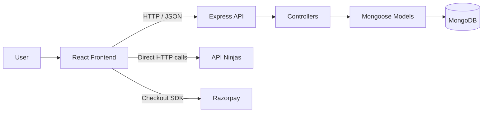

MERN Stack Fitness Tracker ( Fitness Tracker ) 🏋️‍♂️💻

Welcome to the MERN Stack Fitness Tracker, a cutting-edge solution designed to revolutionize personal health management using modern web technologies. This platform offers a dynamic and interactive way for users to log and monitor their fitness activities. 🚀

## ✨ Key Features

- 🖥️ **User-Friendly Interface:** Built with React, providing an intuitive and responsive design.
- 🔒 **Secure Authentication:** Robust login and registration handled via Node.js and MongoDB, ensuring data security.
- 📊 **Comprehensive Tracking:** Log daily activities such as step count, water intake, calories burned, and workout sessions.
- 🤝 **Social Interaction:** Share progress, participate in community challenges, and engage with a supportive fitness community.
- ⏱️ **Real-Time Data:** Update and access fitness data instantly with secure, cloud-based storage.
- 📱 **Enhanced User Experience:** Mobile responsiveness with Tailwind CSS and engaging animations powered by GSAP.
- 🧮 **Health Calculators:** Includes BMI, BMR, Body Fat percentage, and 1RM calculators for personalized fitness insights.
- 🛒 **E-Cart:** Purchase necessary workout tools directly from the platform.

## 🔮 Future Work

- 📈 **Expanded Health Metrics:** Integration with wearable devices and more detailed health tracking.
- 🤖 **Personalized Features:** AI-driven fitness recommendations and advanced nutrition tracking.
- 🔄 **Continual Improvement:** Ongoing enhancements to adapt to evolving fitness trends and technologies.

# FitCheck 🏃‍♂️

FitCheck is a fitness engagement platform built on a client-server MERN-style architecture. It combines user onboarding, fitness goal capture, workout/event publishing, calculator utilities, health-information lookups, a lightweight progress dashboard, and a simple equipment storefront into a single web experience. 💪

The product appears to target individuals who want a guided entry point into fitness rather than a narrow workout logger. The system blends three user needs in one place:

- 📝 personal onboarding and goal setting
- 🏋️ discovery and publishing of workout-related activities
- 🧰 supporting utilities such as calculators, nutrition lookup, and equipment browsing

At a high level, the frontend delivers a highly visual, animation-heavy React experience, while the backend provides a small REST API for authentication, workout/event persistence, and goal capture backed by MongoDB.

## 1. Project Overview 🗂️

### Problem Statement ❓

Most fitness products solve only one part of the journey: tracking, coaching, community, or commerce. FitCheck attempts to unify these concerns into a single entry-point application where users can:

- create an account
- define their personal fitness goals
- explore or publish workout posts/events
- use calculators for common health metrics
- access external health/nutrition content
- browse and purchase fitness equipment

### Solution Approach 🛠️

FitCheck uses:

- a React SPA for onboarding, dashboards, calculators, and content flows
- an Express API for user, goal, and workout/event data
- MongoDB for persistence of users, goals, and event records
- external APIs and browser-side integrations for enrichment such as nutrition data and payments

### Target Users 🎯

- fitness beginners looking for guided setup and motivation
- general consumers tracking broad wellness goals
- users exploring workouts, nutrition, and equipment in one application

---

## 2. Architecture Overview 🏗️

### System Style 🖥️

FitCheck is implemented as a **client-server web application** with:

- a standalone React frontend in `frontend/`
- a standalone Node.js/Express backend in `backend/`
- MongoDB as the persistence layer

This is not a microservices system. The backend is a single service exposing a small REST API surface.

### Architectural Patterns 🧩

- **SPA frontend** using `react-router-dom`
- **REST-style API** for backend communication
- **MVC-like backend separation**
  - routes
  - controllers
  - models
  - config
- **Document data modeling** with Mongoose
- **Component-oriented UI composition** in React

### High-Level Data Flow 🔄



### Request Flow 🔃

1. User interacts with the React application.
2. Frontend submits requests to the Express API at `/api/users/...`.
3. Controllers validate/process input and persist documents via Mongoose.
4. MongoDB stores users, goals, and workout/event records.
5. Some frontend features bypass the backend and directly call third-party services.

### Important Current Architectural Note ⚠️

JWT authentication is implemented for sign-in token generation and an `auth` middleware exists, but the middleware is **not currently attached to protected routes**. In practice, the API behaves as mostly public.

---

## 3. Tech Stack 🧑‍💻

### Frontend 🎨

- React 18.3.1
- React Router DOM 6.26.0
- Axios 1.7.7
- Tailwind CSS 3.4.9
- GSAP 3.12.5
- AOS 2.3.4
- Chart.js 4.4.6
- React ChartJS 2 5.2.0
- React Calendar 5.1.0
- React Dropzone 14.2.3
- React Icons 5.3.0
- use-sound 4.0.3 / Howler 2.2.4
- Create React App / `react-scripts` 5.0.1

### Backend 🛠️

- Node.js
- Express 4.19.2
- Mongoose 8.5.4
- JSON Web Token 9.0.2
- bcryptjs 2.4.3
- multer 1.4.5-lts.1
- cors 2.8.5
- dotenv 16.4.5

### Database 🗄️

- MongoDB
- Mongoose ODM

### External Integrations 🌐

- API Ninjas
  - calories burned
  - exercise lookup
  - nutrition lookup
  - recipe lookup
  - cocktail lookup
- Razorpay Checkout

### Tooling 🧰

- npm
- Tailwind utility styling
- CRA testing libraries present via default scaffold:
  - `@testing-library/react`
  - `@testing-library/jest-dom`
  - `@testing-library/user-event`

---

## 4. Features & Functionalities 🏅

### Core Product Features ⭐

- 👤 **User registration and sign-in**
  - sign-up stores user credentials in MongoDB
  - passwords are hashed using bcrypt in a Mongoose pre-save hook
  - sign-in returns a JWT token with 1-hour expiry

- 🎯 **Goal onboarding**
  - multi-step intake flow captures name, goal type, baseline activity, sex, DOB, height, and weight targets
  - data is persisted to MongoDB through the backend

- 📝 **Workout/event publishing**
  - users can create workout posts with:
    - image upload
    - workout name
    - description
    - tool/equipment
    - venue
    - date/time
    - BMR and diet notes
  - images are uploaded through `multipart/form-data`

- 📰 **Workout/event feed**
  - frontend fetches all stored workout posts and renders them as cards
  - binary images are reconstructed in the browser from MongoDB buffer data

### Wellness Utilities 🧮

- 📏 BMI calculator
- 🔥 BMR/TDEE calculator
- 🧑‍🔬 Body fat calculator
- ❤️ Heart-rate range calculator
- 🏋️‍♂️ 1RM calculator
- ⏲️ Stopwatch/timer component

### Health Information Modules 🩺

- 🔥 Calorie-burn lookup
- 💪 Exercise lookup by muscle group
- 🥗 Nutrition lookup
- 🍲 Recipe lookup
- 🍹 Cocktail lookup

### Progress Experience 📈

- 📅 Calendar-based daily tracking UI
- 📊 Bar-chart visualization of daily metrics
- 📝 Fields for step count, water, calories, duration, distance, heart rate, sleep, weight, reps, and notes

### Commerce / Engagement 🛒

- 🏋️ Equipment catalog with add-to-cart behavior
- 💳 Razorpay-based checkout flow loaded dynamically in the browser
- 🤖 Rule-based in-app chatbot for basic fitness Q&A

### Real-World Relevance 🌍

The application is positioned as a broad fitness companion rather than a narrow tracker. Its strongest real-world value is the combination of onboarding, calculators, lightweight social posting, and informational utilities in one product surface.

---

## 5. Folder Structure 📁

```text
FitCheck-MERN-stack/
├── backend/
│   ├── server.js
│   ├── package.json
│   └── src/
│       ├── config/
│       ├── controllers/
│       ├── middleware/
│       ├── models/
│       └── routes.js
├── frontend/
│   ├── public/
│   ├── src/
│   │   ├── components/
│   │   │   ├── Api-components/
│   │   │   └── child-components/
│   │   ├── images/
│   │   ├── sounds/
│   │   ├── App.js
│   │   ├── App.css
│   │   └── index.js
│   ├── package.json
│   └── tailwind.config.js
└── README.md
```

### Why the Structure Matters 🏗️

#### `backend/src/config` ⚙️

Holds infrastructure setup, currently the MongoDB connection module. This keeps environment-sensitive bootstrapping away from business logic.

#### `backend/src/models` 🗂️

Contains Mongoose schemas for:

- `User`
- `Goal`
- `Event`

This separation is important because persistence concerns remain centralized and reusable across controllers.

#### `backend/src/controllers` 🧑‍💻

Encapsulates request handling and business actions such as:

- user creation
- sign-in
- goal creation
- event creation/fetching

This keeps route declarations thin and improves maintainability.

#### `backend/src/middleware` 🛡️

Reserved for cross-cutting concerns. The existing JWT auth middleware indicates the codebase is moving toward protected-route enforcement even though that is not fully wired yet.

#### `frontend/src/components` 🖼️

Top-level application screens such as sign-up, sign-in, navigation, home, goals, and footer live here. This reflects a page-oriented UI organization.

#### `frontend/src/components/child-components` 🧩

Feature-level UI modules live here:

- calculators
- add-post form
- progress dashboard
- cart/payment
- about/contact
- chatbot
- timer

This division makes the main route tree easier to reason about.

#### `frontend/src/components/Api-components` 🌐

External data integrations are isolated into their own module family. This is a sound organizational choice because third-party dependency logic tends to evolve independently from core product flows.

#### `frontend/src/images` and `frontend/src/sounds` 🖼️🔊

The application is heavily media-driven, so static assets are kept close to the frontend. This suits the current implementation, which emphasizes branded visuals and audio feedback.

---

## 6. Key Engineering Decisions 🛠️

### 1. Separate frontend and backend applications 🔗

**Why:** clean separation of concerns and easier independent development.  
**Trade-off:** duplicated setup steps and hardcoded local URLs currently couple environments manually.

### 2. MongoDB + Mongoose for flexible document storage 🗄️

**Why:** onboarding forms and workout/event payloads are naturally document-shaped and evolve easily.  
**Trade-off:** weaker schema strictness compared with more opinionated relational modeling unless validation is rigorously enforced.

### 3. Image storage in MongoDB as `Buffer` 🖼️

**Why:** simple implementation for prototypes and small-scale usage; avoids object storage setup.  
**Trade-off:** poor scalability for larger media volumes, larger document sizes, higher database memory pressure, and slower feed delivery.

### 4. Client-side direct integration with third-party APIs 🌐

**Why:** fast implementation and minimal backend complexity.  
**Trade-off:** API keys are exposed in the frontend and should be moved server-side for production use.

### 5. Local component state over centralized state management 🧠

**Why:** most workflows are isolated and can be handled with `useState`.  
**Trade-off:** as the app grows, shared auth/session/data caching concerns become harder to coordinate. Notably, `react-redux` exists in dependencies but is not currently used.

### 6. Animation-led UX 🎬

**Why:** GSAP, AOS, sound effects, and media-heavy layouts create a high-engagement consumer experience.  
**Trade-off:** animation-heavy interfaces require tighter performance discipline on lower-end devices.

---

## 7. Setup & Installation ⚙️

### Prerequisites 📝

- Node.js 18+ recommended
- npm 9+ recommended
- MongoDB instance
  - local MongoDB or MongoDB Atlas

### Environment Variables 🔑

Create a `.env` file inside `backend/` or ensure the root-level resolution used by `backend/src/config/db.js` can access the file.

```env
MONGO_URI=<your-mongodb-connection-string>
JWT_SECRET=<your-secure-jwt-secret>
PORT=5000
```

### Install Dependencies 📦

#### Backend 🛠️

```bash
cd backend
npm install
```

#### Frontend 🎨

```bash
cd frontend
npm install
```

### Start the Application ▶️

#### Run backend 🛠️

```bash
cd backend
node server.js
```

#### Run frontend 🎨

```bash
cd frontend
npm start
```

### Access URLs 🌐

- Frontend: `http://localhost:3000`
- Backend: `http://localhost:5000`

### Production-Aware Notes 🚦

- Frontend API calls are hardcoded to `http://localhost:5000`; production deployment will require environment-based API base URLs.
- API Ninjas keys are currently embedded in frontend source and should be externalized.
- Razorpay uses a hardcoded test key in the client; production should use environment-specific configuration and server-side order creation.

### Docker 🐳

No Docker configuration is present in the repository.

### CI/CD 🔄

No CI workflow or deployment pipeline configuration is present in the repository.

---

## 8. API Documentation 📚

Base path: `/api/users`

### `POST /signup`

Creates a new user account.

**Request**

```json
{
  "email": "user@example.com",
  "password": "strong-password"
}
```

**Response**

```json
{
  "message": "User created successfully"
}
```

### `POST /login`

Authenticates a user and returns a JWT.

**Request**

```json
{
  "email": "user@example.com",
  "password": "strong-password"
}
```

**Success Response**

```json
{
  "message": "Sign-in successful",
  "token": "<jwt>"
}
```

### `POST /goals`

Stores onboarding/goal data.

**Request**

```json
{
  "firstName": "Jane",
  "lastName": "Doe",
  "goals": "Lose Weight",
  "baselineActivity": "Active",
  "sex": "female",
  "dob": "1998-04-10",
  "height": 165,
  "currentWeight": 72,
  "goalWeight": 64
}
```

**Response**

```json
{
  "message": "Goal created successfully",
  "goal": {
    "_id": "...",
    "firstName": "Jane"
  }
}
```

### `POST /add`

Creates a workout/event post with image upload.

**Content-Type**
`multipart/form-data`

**Fields**

- `image`
- `workoutName`
- `description`
- `tool`
- `venue`
- `startDate`
- `startTime`
- `endTime`
- `bmr`
- `diet`

**Response**

```json
{
  "message": "Event created successfully",
  "event": {
    "_id": "...",
    "workoutName": "Morning Cardio"
  }
}
```

### `GET /get`

Returns all workout/event posts.

**Response**

```json
[
  {
    "_id": "...",
    "workoutName": "Morning Cardio",
    "description": "30-minute HIIT session",
    "image": {
      "type": "Buffer",
      "data": [
        /* ... */
      ]
    }
  }
]
```

### Authentication Mechanism 🔒

- JWT is issued on successful login.
- Middleware exists to validate `Authorization: Bearer <token>`.
- Current routes do **not** enforce the middleware, so authentication is not yet consistently applied.

---

## 9. UI/UX Overview 🎨

### Main Screens 🖥️

- `Signup`: multi-step intro and account creation flow
- `Signin`: credential-based login flow
- `Goals`: multi-step onboarding questionnaire
- `Home`: hero section, stopwatch, workout feed access
- `Add Event`: workout/event submission form with drag-and-drop image upload
- `Calculator`: nested calculator hub
- `Health`: third-party data lookup hub
- `Progress`: chart + calendar dashboard
- `Cart`: product listing and checkout
- `About` and `Contact`: brand and support pages

### State Management Approach 🧠

- primarily local component state with `useState`
- route-based composition using nested React Router routes
- no active global store despite Redux dependency presence

### UX Characteristics ✨

- animation-heavy onboarding and transitions using GSAP/AOS
- strong visual branding with custom imagery, fonts, audio, and overlays
- responsive behavior is present in several components via Tailwind utility classes
- chatbot is globally accessible through the footer

### Accessibility Observations ♿

Accessibility has not been systematically implemented. Areas for improvement include:

- form labeling
- keyboard interaction coverage
- semantic button/link consistency
- alt-text quality
- reduced-motion handling for animated flows

---

## 10. Scalability & Performance 🚀

### Current Strengths 💪

- frontend and backend are decoupled enough to scale independently
- Mongoose models provide a clear persistence boundary
- feature areas are modularized in the UI

### Current Constraints ⚠️

- event images stored directly in MongoDB will not scale well
- all events are fetched without pagination or filtering
- no caching layer exists
- no query optimization, search, or feed ranking is implemented
- third-party API calls happen directly from the client with no aggregation or throttling layer
- progress tracking is client-side only and not persisted

### Recommended Growth Path 🌱

- move image storage to object storage such as S3/Cloudinary
- add pagination and filtering to event feed APIs
- introduce backend-side third-party API proxying and caching
- use environment-based API configuration
- persist progress entries as first-class domain data
- add request validation and indexing for high-read collections

---

## 11. Security Considerations 🔒

### Implemented ✅

- bcrypt password hashing before persistence
- JWT generation for authenticated sessions
- environment variables for backend secrets
- basic CORS and JSON middleware setup

### Gaps to Address Before Production ⚠️

- auth middleware is not enforced on protected routes
- API Ninjas key is hardcoded in frontend source
- Razorpay key is hardcoded in frontend source
- no server-side input validation library is used
- no rate limiting
- no helmet/security headers
- no password policy enforcement
- no refresh-token/session revocation strategy
- no authorization checks tying events/goals to authenticated users

### Production Best Practices Recommended 🏆

- use `helmet`, request validation, and rate limiting
- move external API secrets to server-side environment variables
- protect mutating routes with auth middleware
- bind records to `req.user.userId`
- implement audit logging for critical flows
- avoid storing binary media directly in MongoDB documents

---

## 12. Testing Strategy 🧪

### Current State 📋

The repository includes frontend testing libraries via CRA defaults, but there are **no meaningful tests implemented** in the checked-in codebase.

### Observed Backend State 🛠️

- backend `npm test` is a placeholder that exits with an error

### Recommended Testing Strategy 📝

- **Unit tests**
  - controller logic
  - calculator formulas
  - utility functions
- **Integration tests**
  - auth flows
  - goal creation
  - event upload/retrieval
  - MongoDB-backed route testing
- **E2E tests**
  - sign-up to goal onboarding
  - login to event posting
  - checkout initiation
  - health lookup workflows

Suggested tools:

- 🃏 Jest
- 🧪 React Testing Library
- 🚦 Supertest
- 🕹️ Playwright or Cypress

---

## 13. Deployment 🚀

### Current Repository State 📦

No deployment manifests or environment promotion pipeline are included.

### Practical Deployment Model 🌍

#### Frontend 🎨

Could be deployed to:

- Vercel
- Netlify
- S3 + CloudFront
- any static hosting platform

#### Backend 🛠️

Could be deployed to:

- Render
- Railway
- Fly.io
- AWS ECS / EC2
- any Node.js-capable platform

#### Database 🗄️

- MongoDB Atlas is the most natural managed option

### Environment Strategy ⚙️

A production-ready setup should define:

- `development`
- `staging`
- `production`

Each environment should have its own:

- API base URL
- database connection string
- JWT secret
- third-party API credentials
- payment configuration

---

## 14. Future Improvements 🔮

- Enforce authenticated and authorized API access across all mutating routes
- Associate goals and events with specific users
- Replace hardcoded frontend secrets with server-side configuration
- Introduce image storage via object storage/CDN
- Add pagination, filtering, and search for workout/event feed
- Persist progress-tracker entries to MongoDB
- Add form validation and structured error handling on both client and server
- Introduce centralized API client and environment-driven configuration
- Add automated tests and CI quality gates
- Improve accessibility and reduced-motion support
- Add admin/reporting capabilities for moderation and analytics
- Replace mock/local like-comment behavior with persisted social interactions

---

## 15. Contribution Guidelines 🤝

Contributions should preserve the existing split between frontend and backend responsibilities.

### Recommended Workflow 🛠️

1. Fork the repository.
2. Create a feature branch from `main`.
3. Keep backend and frontend changes scoped and intentional.
4. Add or update tests for any behavioral change.
5. Validate both apps locally before opening a PR.
6. Submit a pull request with:
   - problem statement
   - implementation summary
   - screenshots for UI changes
   - notes on API/schema changes

### Engineering Expectations 📏

- keep routes thin and business logic in controllers/services
- maintain schema clarity in Mongoose models
- avoid hardcoded environment-specific URLs and secrets
- document new environment variables
- prefer reusable UI components for repeated patterns

---

## 16. Screenshot 🖼️


## 17. Contact

For any queries or support, feel free to reach out:

- **Email**: sdivakar2005@gmail.com
- **LinkedIn**: https://www.linkedin.com/in/divakar-srinivasan/
- **GitHub**: [divakar-srinivasan](https://github.com/divakar-srinivasan)

---

Made with ❤️ by DIVAKAR S.
